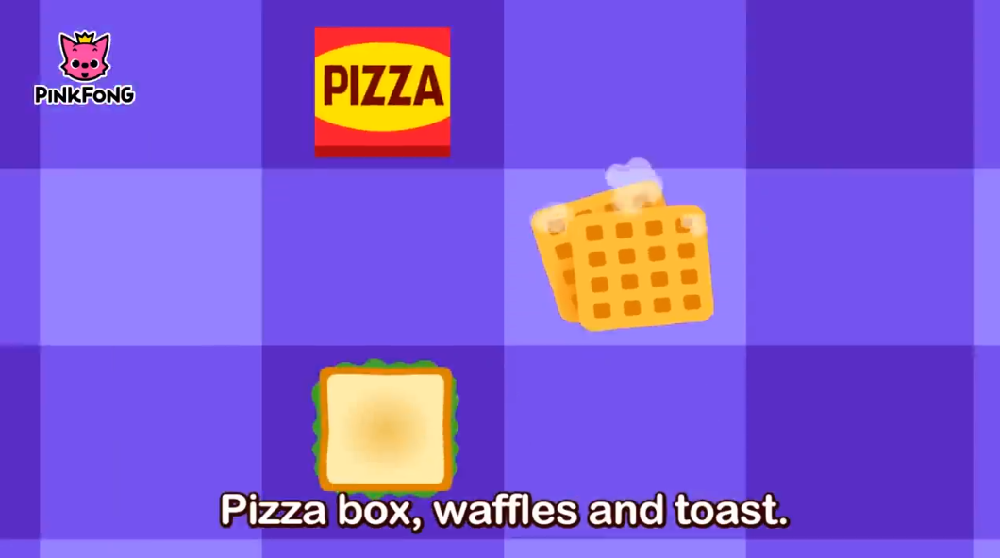
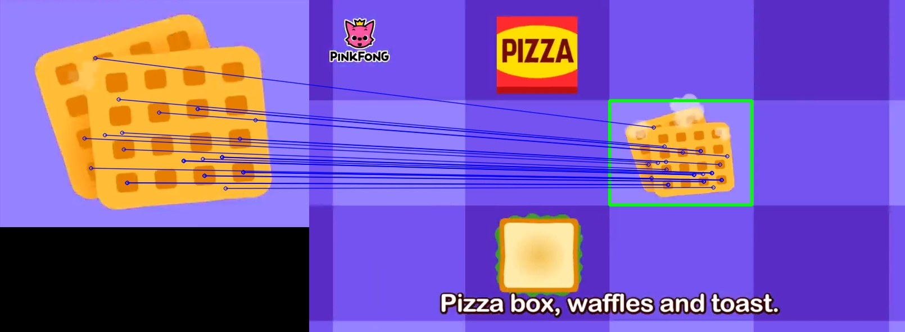

# Feature Matcher (SIFT + FLANN)

This project uses **SIFT** feature extraction and **FLANN** matcher to locate an object from a query image inside a target image or video.

---

## Project Structure

```
feature_matcher/
├── notebooks/ 
├── main.py             # CLI entry point
├── matcher.py          # Matching logic
├── utils.py            # Drawing and saving 

├── images/ 
│   ├── q1.png          # Query image
│   └── t1.png          # Target image

├── videos/
│   └── t1.mp4          # Target video

├── results/
│   ├── result_image.jpg    # image matching
│   └── result_video.mp4    # video matching

└── README.md
```

---

## Installation

```bash
pip install opencv-python opencv-contrib-python matplotlib numpy
```

---

## Usage

### Image Matching

```bash
python main.py --mode image --query images/q1.png --target images/t1.png
```

- Result saved to: `results/result_image.jpg`

### Video Matching

```bash
python main.py --mode video --query images/q1.png --target videos/t1.mp4
```

- Result saved to: `results/result_video.mp4`

---

##  Example Results

| Query Image | Target Image | Result |
|-------------|--------------|--------|
|  |  |  |

> 🟩 Green polygon: Detected object  
> 🔵 Blue lines: Matched keypoints  

---

##  Video Result

View a sample video output here:

📹 [Result Video](results/result_video.mp4)

---

##  Notes

- The system uses Lowe's ratio test (0.75) to filter good matches.
- Homography with RANSAC is used to transform object corners and detect position.

---

## 👨‍💻 Authors

Ahmed Gamea, Abdelaziz Essam, and Moustafa Rezk 